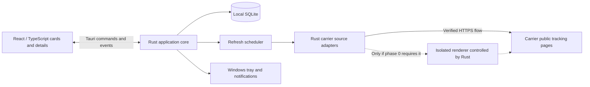

# Walle — Personal Package Tracker

Version: 1.0 · Date: 2026-09-14 · Status: implemented first release

## 1. Product goal

A small Windows desktop app for tracking personal parcels. Add a tracking number and a memorable name, then see what is arriving, what needs attention, and what has been delivered. Package cards and timelines are the primary interface.

Use Tauri v2, store the user's collection locally, and retrieve tracking updates automatically from carrier public tracking pages through Rust scraping adapters. Use Docker for as much development, testing, and building as practical. The installed app runs as a normal Windows application.

This document records the implemented first release and the reasoning behind it. The app, carrier adapters, local persistence, scheduler, tray behavior, notifications, Docker checks, and Windows packaging workflow are present in this repository.

The detailed [scraper implementation plan](docs/SCRAPER_IMPLEMENTATION_PLAN.md) defines source discovery, Rust module contracts, HTTP and optional browser retrieval, carrier-specific work, Docker checks, and live validation milestones.

## 2. Decisions from the discussion

| Topic | Decision | Basis |
| --- | --- | --- |
| Audience | One person; personal use, no commercial distribution | Confirmed |
| Desktop framework | Tauri v2 | Confirmed |
| Platform and storage | Windows; collection stored on this computer | Confirmed |
| Carriers and geography | DHL and Hermes; deliveries to multiple European countries, excluding the UK | Confirmed |
| Tracking | Automatic updates through scraping; no paid tracking API subscription | Latest confirmed direction; supersedes the earlier API preference |
| Main interface | Visual package cards with progress timelines | Confirmed; supersedes the initial table suggestion |
| Background behavior | Keep running in the system tray; alert for delivery, pickup, and problems | Confirmed |
| Language | English | Confirmed |
| Docker | Use as much as possible, including the build workflow | Confirmed |
| Backend implementation | Rust for tracking adapters, scheduling, persistence, and native integration; no Python, Ruby, or PHP application dependency | Confirmed Rust direction |
| Added references | Scraper research informs fresh Rust adapters; the supplied AfterShip guide is retained as inactive historical reference | Latest direction; no AfterShip implementation planned |
| UI implementation | React, TypeScript, Vite, CSS design tokens | Proposed technical default |
| Themes | System default, with light and dark overrides | Proposed design default |
| Windows target | Windows 11 x64 initially | Proposed testing baseline; confirm the actual machine during setup |
| Runtime topology | Rust backend inside Tauri; no local server or Docker runtime dependency | Proposed interpretation of the Docker build preference |
| Cost | No paid tracking API subscription; scraping maintenance and possible browser overhead remain | Confirmed subscription preference; reliable free access is not established |

Working name: **Walle**, based on the project folder. Naming and custom branding are low-priority decisions.

## 3. Scope and success criteria

### Version 1

- Add a parcel with a name, tracking number, and confirmed carrier/service.
- Help choose the carrier when detection is possible; allow manual selection.
- Offer optional destination country and postcode when needed for carrier resolution or additional details.
- Show active parcels as cards with status, delivery estimate, latest event, and last successful check.
- Offer locally persistent comfortable and compact package-bay layouts; compact mode shows four cards per row when the window is wide enough.
- Open a full event timeline without losing the collection's filters or scroll position.
- Search by name or tracking number; filter by carrier and status group.
- Refresh automatically and on request, with conservative per-host throttling and source compatibility checks.
- Rename, archive, restore, and delete entries.
- Keep cached information available offline and after restart.
- Run in the tray and send selected Windows notifications.
- Show source health, last successful check, and an actionable recovery path when a carrier page changes or blocks a request.
- Produce a Windows installer through the Docker build workflow where the selected dependencies support it.

Success means adding a parcel takes only a few fields, the main screen answers “what needs my attention?”, and an update failure never makes a parcel appear lost or delivered.

### Outside version 1

Cloud sync, app accounts, multi-user access, shipping-label purchases, mailbox scanning, shop integrations, maps or live vehicle positions, mobile apps, UK/Evri support, and a hosted backend. A compact table view, bulk import, and portable backup/export can follow after the basic workflow works well.

## 4. Carrier coverage and scraping decision

### 4.1 What “DHL and Hermes across Europe” means

The requested scope is domestic and cross-border DHL/Hermes shipments to European destinations outside the UK. Europe is not synonymous with the EU. Country selection alone must not imply that every product or route is supported.

Begin validation with two explicit source adapters: **DHL Paket Germany** and **Hermes Germany**. A carrier's German tracking page may expose cross-border history, but this does not establish coverage of all its European services or the final delivery partner. Regional and Express support stays disabled until verified separately.

| Carrier family | Initial disposition | Required validation |
| --- | --- | --- |
| DHL Paket Germany | First source adapter candidate | Real user-owned recipient parcels; domestic and representative cross-border routes; optional postcode; history and ETA availability |
| Hermes Germany | First source adapter candidate | Real user-owned parcels from unrelated shops; domestic and representative cross-border routes; optional postcode and partner handoffs |
| DHL Express | Separate adapter, disabled until verified | Current Express source and request behavior; separate service selection and number assumptions |
| Other DHL regional/eCommerce services | Disabled until individually verified | Exact source, service, required fields, and representative routes |
| Other Hermes-labelled European services | Disabled until individually verified | Exact service and source; do not infer compatibility from shared branding |
| UK / Evri | Excluded | Do not resolve an ambiguous Hermes selection to a UK service |

A handoff stays on the same parcel only when the carrier supplies the relationship. Show the partner and linked number in details. Do not invent missing events or assume that the first carrier exposes the final delivery leg.

Maintain a coverage manifest with `carrier_key`, `source_key`, allowed hosts, parser version, required fields, tested routes, validation date, and known limitations. Source compatibility is an implementation gate, not a claim of universal European coverage.

### 4.2 Research and current evidence

The detailed review is [Scraper reference review](docs/research/scraper_review.md). The following findings guide implementation; none establishes a working live parcel integration:

- **sauladam/shipment-tracker:** latest default-branch commit 15 June 2022; latest release 0.7.0 on 1 December 2020. Its DHL Paket parser still depends on a particular script position and embedded `initialState` structure; the last substantive parser/request update was December 2020. Its DHL Express file last changed in June 2017, and Hermes is absent. Useful for adapter and event-model ideas, not for copying old selectors. [History](https://github.com/sauladam/shipment-tracker/commits/master/), [DHL parser](https://github.com/sauladam/shipment-tracker/blob/ad1b2e53043f7df7ba05f9bcfe666152f6f8673a/src/Trackers/DHL.php#L169)
- **TheBookPeople/hermes-scraper:** latest commit and version 0.0.6 date to 20 May 2016. This is a legacy UK Hermes reference, not evidence of Hermes Germany support. Its historical request flow and selectors must not become Walle's integration contract. [History](https://github.com/TheBookPeople/hermes-scraper/commits/master/)
- An open shipment-tracker issue reports blocked DHL requests, but its author later clarified that this meant **DHL Express**, with regular DHL untested. Do not generalize that historical report to current DHL Paket behavior. [Clarification](https://github.com/sauladam/shipment-tracker/issues/28#issuecomment-999999509)

Current starting points are [DHL Paket public tracking](https://www.dhl.de/de/privatkunden/dhl-sendungsverfolgung.html) and [Hermes Germany public tracking](https://www.myhermes.de/empfangen/sendungsverfolgung/). Their current bundles expose anonymous JSON flows that the Rust adapters now implement. End-to-end probes confirmed DHL's not-found response, a complete user-owned DHL international history through delivery, Hermes' invalid-input response, and a user-owned Hermes international shipment in the announced state with its partner handoff link. Browser rendering is unnecessary for the observed request flows, but remains a future fallback only if those flows change.

Scraping removes the planned paid tracking API subscription. It does not guarantee continuous free access, stable page structures, or freedom from maintenance, rate limits, and challenges. The app must communicate these failures without corrupting cached parcel state.

### 4.3 Source compatibility gate

Before enabling a source for automatic tracking:

1. Inspect its current public tracking flow and record the required inputs, allowed hosts, redirects, response shape, localization, and any JavaScript dependency. Do not port a legacy endpoint or selector simply because it appears in a reference repository.
2. Test user-owned DHL Paket and Hermes Germany parcels from unrelated shops, including representative cross-border routes to the user's actual countries. Test not-yet-found, in-transit, pickup, delivered, and postcode-required cases where examples are available.
3. Establish whether a reused `reqwest::Client` plus an HTML/JSON parser can retrieve the data. If browser execution is necessary, prove an isolated renderer controlled by Rust and record its installation, resource, privacy, and Windows/Docker implications before adopting it. Do not add a Python, Ruby, or PHP runtime.
4. Demonstrate repeated scheduled retrieval from real parcels with conservative throttling. Verify current status, event history, missing estimates, locale/timezone handling, terminal-state corrections, and source errors. A page fetch or one static response alone does not pass this gate.
5. Detect challenges, access denials, rate limits, unexpected redirects, and incompatible response structures. Pause or back off; preserve the last known status. Do not bypass challenges. Check documented access constraints before enabling automated retrieval; an HTTP success alone does not establish suitability.
6. Record the validated route matrix and parser version, add synthetic fixtures, and verify the installed Windows path. Disable an unverified service and describe the exact gap instead of silently matching another regional carrier.

If either required source fails this gate, local collection and UI work can continue, but automatic tracking remains incomplete. **Open carrier website** is a recovery action, not a substitute for the automatic-update acceptance criterion.

### 4.4 Rust adaptation and historical reference

Implement separate Rust source adapters behind a shared snapshot contract. Use `reqwest` for verified HTTP flows, `serde` for observed JSON shapes, and an HTML parser such as `scraper` where needed. Select concrete parser dependencies during phase 0. A source may expose embedded JSON or rendered HTML; neither format is assumed in advance. A renderer, if proven necessary, stays isolated from the privileged Tauri main window and returns only bounded data to Rust.

The preferred renderer experiment is a feature-gated Rust `chromiumoxide` worker controlling an isolated installed Edge process on Windows, with Chromium for Linux fixture checks. Its compatibility and browser prerequisite must pass the detailed plan's Windows validation before adoption; it is not an established runtime dependency.

Each adapter owns input normalization, allowed source URLs, fetch/parsing behavior, status mapping, optional fields, source capabilities, and parser version. Preserve unknown statuses and original carrier wording. Never turn a missing selector, challenge page, or unrelated response into “not found,” “delivered,” or an empty successful history. Verify response identity before applying a snapshot; a mismatched number/service is an error.

Reference: [Hermes and DHL tracking with the AfterShip API](docs/references/aftership_hermes_dhl_guide.md), supplied by the user on 2026-09-11. Preserve this file unchanged as an **inactive historical reference**. Its Python examples and instructions about credentials, remote registration, and webhooks do not apply to this design. AfterShip and other paid tracking API integrations are not planned. No API credential, remote tracking ID, provider registration, or remote deletion queue is required for the chosen approach.

Synthetic Rust fixtures cover HTML/JSON variants, missing fields, source changes, unknown statuses, challenge/access-denial pages, rate limits, and identity mismatches. They test adapter behavior only; real recipient coverage must pass the separate source compatibility gate.

## 5. Main screen and visual design

### 5.1 Collection layout

Use one main window, approximately 1180 × 800 by default, with a practical minimum near 800 × 600. Preserve window size and position. No permanent navigation sidebar is needed for three views.

```text
Walle                                      Refresh all   + Add package   Settings

[ Search packages...                         ]  Carrier: All  Sort: Attention

Active (6)       Delivered (2)       Archive
All active       Arriving soon       Needs attention

┌───────────────────────────────────┐  ┌───────────────────────────────────┐
│ Mechanical keyboard      DHL      │  │ Running shoes            Hermes   │
│ OUT FOR DELIVERY                  │  │ READY FOR PICKUP                  │
│ Expected today, 12:00–16:00        │  │ Pickup location in details        │
│                                   │  │                                   │
│ ● Announced ─ ● Transit ─ ◉ Today  │  │ ● Announced ─ ● Transit ─ ◉ Pickup│
│ Loaded onto delivery vehicle      │  │ Available at parcel shop          │
│ Checked 8 min ago                 │  │ Checked 22 min ago                │
│ View details            Refresh ⋯ │  │ View details            Refresh ⋯ │
└───────────────────────────────────┘  └───────────────────────────────────┘
```

The example is fictional layout content. Estimates and events appear only when supplied by the carrier.

- Two columns at the default width; one on narrow windows; three only when cards remain comfortably readable.
- Cards have consistent padding and structure, around 340 px minimum width, and expand for longer content.
- Main emphasis: package name, current status, and delivery/pickup information. Tracking numbers are secondary and fully visible in details.
- Use neutral surfaces, modest borders, 12 px corner radii, and one restrained accent color. Carrier identity is a label or small icon, not the dominant card color.
- Use status text plus icons; color is supplementary. Suggested tones: blue for transit, violet for out for delivery, amber for pickup/attention, green for delivered, gray for unknown/announced.
- Use the Windows system font stack, roughly 14 px body text and 16 px card titles. Avoid tiny timeline labels.

### 5.2 Card contents and sorting

Every card shows: name, carrier, normalized status, optional ETA/pickup message, abbreviated progress, latest carrier event, and last successful check. A failed refresh adds a separate “Could not update” indicator while retaining the shipment status.

Default Active sort: needs attention, ready for pickup, out for delivery, remaining parcels by known expected date, then most recently added; unknown dates last within their group. Apply a stable ID tie-breaker. Preserve selection and keyboard focus when background updates reorder results; announce changed status without stealing focus.

Alternate sorts: expected delivery, recently updated by carrier, and recently added. “Recently updated” uses carrier event time, not polling time. Search and filters combine and remain selected during refresh.

Delivered contains completed, unarchived deliveries. Returned and cancelled parcels remain discoverable in Active until archived, even though polling may have stopped. Counts reflect the collection; filtered result counts are shown separately.

### 5.3 Progress and detail panel

Use a short semantic progress indicator: announced → in transit → out for delivery → delivered. Pickup replaces the final route with ready for pickup → collected/delivered. Unknown stages are not marked as completed. Exceptions, returns, and cancellations use an explanatory banner rather than a misleading completion percentage.

Open details in a right-hand panel, about 420 px wide; use a full-width detail view at smaller sizes. Include:

- Editable package name; full tracking number with Copy; exact carrier/service.
- Current status, carrier wording, ETA with timezone/date precision, and pickup information when available.
- Full event history, newest first, with original timestamps and available locations.
- Separate “Carrier event” and “Last checked” timestamps.
- Refresh, open carrier website, archive/restore, and delete actions.
- Any service limitation, required additional field, or temporary connection problem relevant to this parcel.

## 6. User flows

### Add package

1. Click **Add package** or press `Ctrl+N`.
2. Enter required **Name** and **Tracking number**. Offer a carrier selector with a detection suggestion when available.
3. Ask for destination country or postcode only when required to resolve the service or requested for extra detail. Keep optional fields collapsed initially.
4. Save locally immediately, then queue a source lookup. Show “Waiting for first update” until real data arrives; failed lookups do not discard the entry.
5. If multiple services match, keep the entry awaiting carrier selection and show the candidates. Never silently choose a different regional carrier based only on number length.
6. On success, show the card and the latest available state. Do not replay historical notifications for a newly added parcel.

Validation: trim surrounding whitespace, preserve leading zeros, reject empty values/control characters, and cap input lengths. Proposed limits are 120 characters for names and 100 for tracking numbers; adjust only if a supported source requires it. Avoid universal numeric-only or fixed-length rules. Carrier-specific normalization must preserve the original input for display.

An existing carrier/service + canonical tracking number opens the existing parcel and offers rename or restore. A reused historical number needs an explicit new-shipment flow, separate local ID, and any disambiguating input the source supports. Do not merge its events into the earlier shipment.

### Refresh and offline behavior

Refresh affects eligible parcels through the same scheduler used by background work. Show queued/running/completed feedback and per-parcel failures. A cooldown shows the next eligible check time. Repeated clicks neither create parallel jobs nor bypass limits. A changed page or challenge shows why checking is paused and offers the carrier website.

Offline: show cached cards immediately, mark the connection offline, and allow local edits. On recovery, refresh overdue parcels gradually. A never-found parcel says “No tracking updates yet; check the number or carrier,” not “Lost.”

### Archive and delete

Archive hides a parcel from the working collection and stops local polling. Restore re-enables polling only for nonterminal shipments. Delivered parcels remain in Delivered until the user archives them; automatic archiving is off initially.

Delete asks for confirmation because it removes the local entry and timeline. Cancel queued work and invalidate in-flight responses, then delete the local parcel, events, and scheduling/notification state transactionally. There is no remote tracking registration to remove. Local deletion does not erase the carrier's own records.

### Settings

Keep settings compact: carrier source health, refresh preference, theme, notification categories, start with Windows, and start minimized. Show enabled services, last successful checks, cooldowns, and source limitations. No API key setup is required. Explain that parcel names and collection metadata stay local while a lookup sends the tracking number and necessary additional fields to the selected carrier.

## 7. Status model, updates, and notifications

### 7.1 Two independent states

Shipment state describes the parcel. Fetch state describes the app's ability to check it. They must never share a single enum.

| Shipment state | Meaning | Default action |
| --- | --- | --- |
| `unknown` | No usable status yet, or unmapped carrier value | Preserve raw description; retry when eligible |
| `announced` | Electronic shipment information received | Continue tracking |
| `in_transit` | Moving through the network | Continue tracking |
| `out_for_delivery` | Final delivery route in progress | Highlight on card |
| `ready_for_pickup` | Awaiting recipient collection | Alert and highlight; continue tracking |
| `delivery_attempted` | Delivery attempt unsuccessful | Alert; continue tracking |
| `exception` | Carrier-reported problem/delay | Alert; continue tracking |
| `delivered` | Explicitly delivered/collected | Alert; stop automatic polling |
| `returning` | Return journey in progress | Alert; continue tracking |
| `returned` | Return completed | Alert; stop automatic polling |
| `cancelled` | Carrier explicitly reports cancellation | Stop automatic polling |

Fetch states: `idle`, `queued`, `fetching`, `not_found`, `needs_input`, `offline`, `rate_limited`, `challenge_required`, `access_denied`, `source_changed`, `source_error`, and `unsupported`. Store diagnostic codes separately from user-facing text. `not_found` requires a recognized carrier response for the requested identity; an empty or unrecognized page is a source error.

Map verified carrier codes and substates where available. When only text exists, use explicit locale-aware rules with fixtures; retain the original wording and do not guess a terminal state. A valid newly observed but unmapped status may be `unknown`; a failed parse leaves the cached status unchanged. Do not use ordinal status comparison: a corrected delivery event or return can legitimately change direction. Use source snapshot semantics, event ordering, and deduplication rather than “highest status wins.”

### 7.2 Refresh policy

Proposed conservative intervals, adjustable after source validation and always bounded by source restrictions:

| Condition | Local retrieval target |
| --- | --- |
| Newly added / number not found | One initial lookup, then every 2 hours |
| Announced / successfully retrieved but unmapped status | Every 2 hours |
| In transit | Every 60 minutes |
| Out for delivery / delivery expected today | Every 30 minutes |
| Ready for pickup | Every 4 hours |
| Delivery attempted / exception / returning | Every 2 hours |
| Delivered / returned / cancelled / archived | No automatic retrieval |

These are scheduling targets, not freshness guarantees. A carrier page can lag actual movement. Default to one in-flight lookup per host, at most two across different hosts, at least 30 seconds between lookup starts on the same host, and a five-minute per-parcel manual-refresh cooldown. Apply the same lookup budget to HTTP and renderer jobs, including retries. Essential browser resources are part of one bounded lookup session and do not each wait 30 seconds; record request counts, constrain resource use, and do not use subrequests or simultaneous browser sessions to perform extra parcel lookups. Phase 0 may require slower intervals. User preferences can slow checks but cannot override the validated minimums.

Run one Rust scheduler with persisted due times, per-host throttling, bounded concurrency, and one in-flight operation per parcel. Honor `Retry-After`; use capped exponential backoff with jitter for transient failures. Challenges, access denials, and incompatible page structures pause the affected source with a clear reason; resume only after the cause is resolved and a controlled source check succeeds. Do not retry those failures on every polling tick or add challenge-bypass behavior. Parcels needing input or using an unsupported service pause until their configuration changes.

Manual refresh obeys cooldowns and source pauses. Allow it on unarchived delivered/returned/cancelled parcels when the verified source supports terminal rechecks. If a corrected snapshot is nonterminal, resume automatic scheduling. If a source cannot recheck a terminal shipment, explain the limitation and offer its tracking website. Archived parcels require restoration before checking.

Run an overdue check on startup, network recovery, and wake from sleep. Do not replay every missed polling interval. Persist last attempt, last successful retrieval, host cooldowns, and source pauses across app restarts. After an expected check is missed, show “Update overdue” with its reason while retaining cached data.

### 7.3 Background lifecycle

The window's X button hides it to the system tray. Explain this once in a small in-app message. Tray actions: **Open Walle**, **Refresh active packages**, **Quit**. Quit exits the process and stops checking; a sleeping or powered-off PC cannot perform updates. Start with Windows is a separate opt-in setting, off initially. A second launch focuses the existing instance.

Use Tauri's native tray, autostart, and single-instance integrations. [System tray](https://v2.tauri.app/learn/system-tray/), [Autostart](https://v2.tauri.app/plugin/autostart/), [Single instance](https://v2.tauri.app/plugin/single-instance/)

### 7.4 Notification behavior

Enable categories for delivered, ready for pickup, and problems; delivery-attempt and return events count as problems. Out-for-delivery alerts are optional and off initially. Ask for OS permission at an appropriate first-use point, with a working in-app experience if denied.

Notify only on a meaningful new transition after the initial tracking baseline. Deduplicate across repeated responses and restarts using a persisted event/transition fingerprint. After downtime, send at most the most relevant current alert per parcel; do not replay its entire history. Save the update before sending its notification. Never send parcel-delivery alerts for network, scraping, or source-access failures.

Default notification text includes the parcel name and short status, not the full tracking number or address. Opening an alert should focus that parcel's details. Validate activation and notification branding on the installed Windows app; Tauri documents Windows notification behavior that differs in development. [Notifications](https://v2.tauri.app/plugin/notification/)

## 8. Technical architecture



### Boundaries

- **Frontend:** forms, cards, filters, accessible timelines, presentation state, and typed command calls.
- **Rust core:** validation, source adapters, network requests, scheduler, status normalization, database transactions, and OS integration.
- **SQLite:** source of truth for local parcels, normalized history, settings, and scheduling/notification state.
- **Carrier sources:** public tracking lookups returning verified HTML/JSON or rendered content. No remote registration, webhook, or exposed local HTTP server is needed.
- **Optional renderer:** isolated remote-content execution, with bounded lifetime, navigation, and resource use. Its necessity and packaging must be proven in phase 0; it has no Tauri application capabilities or database access.

This follows Tauri's separation between the UI and core process. Keep DB access and source requests behind narrow commands rather than exposing generic SQL or arbitrary HTTP to the frontend. [Tauri process model](https://v2.tauri.app/concept/process-model/), [Rust commands](https://v2.tauri.app/develop/calling-rust/)

Use a separate platform-independent Rust crate for parcel models, normalization, source adapters, scheduling decisions, and repositories. Inject clock, transport/rendering, and notifier interfaces so most logic can run in Linux containers. The Tauri host supplies Windows implementations and runtime lifecycle.

Proposed libraries: React + TypeScript + Vite for the UI; `reqwest`, `serde`, and an HTML parser where required for Rust source adapters; SQLite through a Rust-owned repository, with a bundled SQLite option evaluated in the cross-build spike. Select and pin compatible concrete versions during scaffolding, including lockfiles and the Rust toolchain. JavaScript-dependent source rendering is an unresolved transport choice, not a promise that `reqwest` alone works. Reference repositories' Python, Ruby, and PHP code are not app or build dependencies.

### Command and adapter contracts

Commands: `list_parcels`, `get_parcel`, `add_parcel`, `update_parcel`, `archive_parcel`, `restore_parcel`, `delete_parcel`, `refresh_parcels`, `get_settings`, `update_settings`, `get_source_health`, `retry_source_check`, and `open_tracking_page`. A retry is a controlled, throttled check after recovery; it cannot override an unresolved access denial or challenge.

Return typed results/errors; emit `parcel_updated`, `refresh_progress`, and `source_health_changed` after committed changes. The UI can reload current state after reconnecting or missing an event. Raw HTML, cookies, and renderer internals never appear in these responses.

The source adapter supports: carrier candidates, input requirements, snapshot retrieval, source capabilities, and typed fetch/parsing errors. Persist its source key and parser version. No registration or remote ID is involved. Keep source-specific URLs and mapping rules inside the adapter. Reuse HTTP clients with connect/total timeouts, response-size limits, and bounded redirects to verified hosts. A successful result must contain a recognized response for the requested tracking identity, even when it explicitly reports no events yet.

### Minimum data model

| Entity | Essential fields |
| --- | --- |
| `parcels` | UUID, name, input tracking number, canonical number, carrier key, source key, destination country, optional postcode, identity generation, normalized status, carrier description, optional ETA, created/updated/archive times |
| `tracking_events` | Parcel ID, carrier event ID when present or stable fingerprint, raw status code, normalized status, description, optional location, event timestamp/precision/timezone, received time, source/parser version |
| `refresh_state` | Parcel ID, fetch state, last attempt, last success, next due, retry count, safe diagnostic, request generation |
| `notification_state` | Parcel ID, baseline initialized, last notified fingerprints |
| `settings` | Versioned UI, lifecycle, enabled source, and refresh preferences |
| `source_state` | Source key, parser version, enabled/paused state, safe reason, last validated check, per-host next allowed request time, retry/backoff state |

Use transactions for snapshot/event/status changes. Deduplicate events and index parcel status, archive state, canonical tracking identity, and event time. Pending carrier selection may have null carrier/source keys and remains unscheduled until resolved. A late response for a deleted or edited tracking identity must be discarded using the parcel generation/version. On an identity edit, start a fresh tracking baseline rather than mixing old events into the new shipment. Track numbers as strings.

Store known instants in UTC and render in the user's local timezone, with original event zone available in details. Retain date-only estimates as dates. An event without a timezone must retain that uncertainty; do not silently append `Z`. ETA absence is “No estimate yet,” not a guessed delivery date.

### Local data and permissions

Resolve the database under Tauri's app data directory, not beside the executable. Use schema migrations and an explicit failure screen if a migration cannot complete; do not overwrite the previous database with an empty one.

No API credential store is required. Parcel names and collection metadata stay local; tracking numbers and necessary country/postcode fields go to the selected carrier. Keep any transient source cookies inside the Rust transport or isolated renderer, never the frontend. Do not collect unrelated browser profiles. Do not store raw responses indefinitely or log full tracking numbers, postcodes, addresses, or session cookies.

Configure capabilities for the bundled main window, use a restrictive content security policy, and render carrier text as text. Open tracking pages through a constrained Rust action using known HTTPS carrier hosts and encoded identifiers. Do not embed remote carrier pages with application privileges. Tauri capabilities constrain exposed operations; Rust-side validation is still necessary. [Capabilities](https://v2.tauri.app/security/capabilities/), [Opener](https://v2.tauri.app/plugin/opener/)

Keep normalized history locally until the user deletes it, subject to any source-specific retention constraint established during validation. Source disappearance or expired online history must not automatically erase cached data. The earlier direct-API retention assumptions are not adopted for public-page adapters. Record any applicable source restriction explicitly before enabling that adapter.

## 9. Docker development and build workflow

### Chosen direction

Maximize Docker use for reproducible tools and automated work. Run Docker Desktop with Linux containers, with services for UI development/checks, Rust core tests, mock tracking responses, and Windows installer cross-compilation. Docker is required for that workflow, not for running the installed tracker.

Tauri documents Linux-to-Windows NSIS builds using the MSVC target and `cargo-xwin`, but describes this route as less tested and recommends native Windows builds when possible. MSI packaging is Windows-only. We deliberately evaluate the NSIS path to honor the Docker preference; installed-app QA remains on Windows. [Windows installer guidance](https://v2.tauri.app/distribute/windows-installer/)

### Planned Compose services

| Service | Purpose | Output / exposure |
| --- | --- | --- |
| `ui-dev` | Vite with a mock IPC implementation and hot reload | Browser preview on loopback only |
| `ui-check` | Dependency install from lockfile, lint, typecheck, UI tests, production asset build | Test results and frontend assets |
| `core-check` | Rust formatting, lint, tests for the platform-independent crate and mock-server integration | Test results; no Windows GUI |
| `tracking-mock` | Synthetic carrier HTML/JSON and changed-page/challenge/error/latency/rate-limit fixtures | Compose internal network; optional loopback port for native development |
| `windows-build` | Build UI, cross-compile Rust/Tauri, bundle an x64 NSIS installer | Exported installer under `artifacts/windows/` |

Share source intentionally and use named dependency caches; keep Linux container outputs separate from native Windows `node_modules` and Rust target directories. The native Tauri UI runs on Windows and can use the container's loopback Vite server for desktop development. Browser previews use fixtures and do not prove native integration. If phase 0 adopts a renderer, add container-based checks where compatible and separately verify its installed Windows runtime; the installed app must not depend on a Docker service.

The build image includes pinned Node/package manager and Rust tools, the Windows MSVC Rust target, LLVM/LLD, clang for C dependencies, NSIS, and `cargo-xwin` with its SDK cache. Configure NSIS as the only bundle target. Representative command inside the build container:

```sh
pnpm tauri build --runner cargo-xwin --target x86_64-pc-windows-msvc
```

Wrap that command in a build script that copies the resulting installer from Cargo's actual target directory to the exported artifact directory. Pin the image base and tool versions, install from lockfiles, and emit a version/build manifest with the installer. These choices aim for a repeatable workflow; they do not claim bit-for-bit reproducible binaries.

Planned developer entry points, to be implemented during scaffolding:

```sh
docker compose up ui-dev tracking-mock
docker compose run --rm ui-check
docker compose run --rm core-check
docker compose run --rm windows-build
```

No real parcel data, postcodes, source cookies, or browser profiles belong in image layers, build arguments, committed fixtures, or logs. Automated checks use synthetic fixtures. Opt-in live source tests receive user-owned parcel inputs at runtime and redact output. Exclude local databases, private session data, dependency trees, and build outputs from Docker context.

### Early build gate and fallback

Before feature work, cross-build a minimal installed app with SQLite, source transport, tray, and notifications enabled, plus the renderer if phase 0 selects one. Install and test it on the user's Windows target. This detects cross-compilation and packaging problems in the actual dependency set early.

If a dependency blocks the container NSIS build, fix its build configuration or choose an equivalent compatible dependency where reasonable. If the route remains impractical, document the exact blocker and keep frontend builds/core tests in Docker while using native Windows packaging as a recorded fallback. Do not claim a successful Docker Windows build without an artifact and Windows smoke test.

Native checks cover WebView2, tray visibility, close/quit, startup, source transport and optional renderer, notifications, and installation/upgrade. Windows development requires the native Tauri prerequisites. [Windows prerequisites](https://v2.tauri.app/start/prerequisites/)

For this personal app, use an NSIS setup executable with WebView2 runtime detection/bootstrapper handling and a stable app identifier. Manual installer upgrades are sufficient initially; a hosted updater and commercial signing setup are deferred.

## 10. Accessibility and edge cases

- Provide keyboard access to card actions, dialogs, filters, and event details; visible focus, Escape to close panels, and focus restoration.
- Use semantic headings, lists, buttons, and labelled inputs; expose progress through meaningful labels, not colored dots alone.
- Support reduced motion, Windows display scaling, long package names, and status text wrapping.
- Empty collection: one clear Add package action. Empty filtered result: explain that filters hide matches and offer reset.
- Partial outage: one source/parcel failure must not block unrelated source refreshes.
- Challenge, access denial, or changed page: retain cached cards, show a clear source problem, and pause affected work with a carrier-website recovery action.
- Unknown carrier event, duplicate event, missing time/location/ETA, postcode mismatch, and partner handoff all require useful fallback text.
- Unexpected app exit: committed data survives; interrupted work is retried safely after restart.
- Pause request completion before applying an identity edit or deletion; an old response cannot recreate a deleted parcel.

## 11. Implementation plan

Follow [Scraper implementation plan](docs/SCRAPER_IMPLEMENTATION_PLAN.md) for the concrete carrier work sequence, deliverables, and completion gates within phases 0 and 2.

| Phase | Work | Exit condition |
| --- | --- | --- |
| 0 — Prove the uncertain parts | Inspect current DHL Paket and Hermes Germany flows; decide HTTP versus isolated rendering; test required user-owned recipient routes and repeated scheduled retrieval; build Docker toolchain and minimal Windows app with actual native dependencies | Both initial sources pass the compatibility gate and the build route is tested, or precise blockers remain documented |
| 1 — Local experience | Scaffold Tauri/React and Rust core; build card collection, add/edit dialog, details timeline, filters, SQLite persistence, and synthetic fixtures | Core collection works offline and persists across restart |
| 2 — Live tracking | Implement the two validated Rust source adapters, normalized statuses, scheduler, source-health feedback, parser fixtures, and error handling | Verified automatic DHL Paket and Hermes Germany updates on the recorded routes; failures preserve cached state |
| 3 — Desktop behavior | Tray, single instance, notifications, optional startup, source-health recovery, and settings | Installed Windows app behaves correctly while visible and hidden |
| 4 — Personal release | Finish themes/accessibility, validate migrations and lifecycle cases, produce installer, document build/use and known coverage | All release criteria below pass on the actual Windows machine |

Keep the two initial adapters concrete after phase 0. Additional regional and DHL Express adapters stay disabled until a demonstrated coverage need and their own compatibility gate justify them. Do not silently return to a paid API when scraping fails.

## 12. Release acceptance criteria

1. A named DHL Paket parcel and a named Hermes Germany parcel can be added and receive genuine automatic updates for the recorded European routes outside the UK; opening a browser alone does not pass.
2. Ordinary user-owned recipient parcels work through validated public sources without paid API subscriptions, API credentials, or the user's own merchant shipping contract. No untested regional/Express source is presented as supported.
3. Cards show current carrier-backed status and optional ETA; selecting a card reveals a usable timeline.
4. Relaunch preserves names, tracking numbers, archive state, cached history, host cooldowns, and source pauses.
5. Duplicate input, ambiguous carriers, and not-found numbers do not create silent incorrect matches.
6. Offline, rate-limit, challenge, access-denial, changed-page, identity-mismatch, and malformed-response cases retain the last known shipment state and show an appropriate fetch problem. Unrecognized pages never become successful empty histories or delivery events.
7. Repeated refreshes and restarts do not duplicate timeline events or notifications; per-host throttling, source pauses, and cooldowns are respected. Announced/unknown parcels have scheduled checks, and unresolved input/source failures pause retries.
8. Closing the window keeps tray updates alive. Quit stops them. Reopening does not start a second scheduler.
9. Installed-app notifications appear for newly observed delivery, pickup, and problem transitions; first-load historical events do not produce a notification flood.
10. Editing/deleting while a request runs cannot apply an obsolete response. Archiving stops polling; restoring follows terminal-status rules. A verified manual correction of a terminal parcel can resume tracking when its source supports rechecking.
11. Docker executes the agreed checks and produces a Windows NSIS artifact, or the documented build fallback identifies the remaining limitation explicitly. The artifact is installed and tested on Windows.
12. The installed app works with Docker Desktop stopped. It needs network access to the verified carrier sources only for fresh tracking information; any selected renderer is packaged or installed without Docker.
13. Essential workflows work by keyboard, in both themes, at the tested Windows scaling settings. No secrets appear in UI responses, logs, fixtures, or build artifacts.

Validation should combine deterministic Rust source-adapter/scheduler tests, focused UI interaction tests, and a short installed-Windows checklist. Synthetic fixtures cover valid snapshots, localized text, unknown states, missing fields, HTML/JSON shape changes, challenges, HTTP failures, backoff, deduplication, and response-identity validation. Live carrier lookups are opt-in smoke tests using user-owned parcels; they do not replace deterministic fixtures or run in every build. Live tests must prove actual scheduled retrieval for release, not merely that a form loads.

## 13. Known release limits and follow-up validation

- **Found-parcel compatibility:** the DHL Paket HTTP adapter successfully parsed a user-owned delivered international parcel and its eight-event history. The Hermes adapter successfully parsed a user-owned announced international parcel and partner handoff link. Later Hermes states, DHL optional-input paths, repeated refreshes, and recovery behavior still require user-owned validation. Scraping avoids paid API subscriptions but does not guarantee stable access or timely source updates.
- **Concrete European routes:** choose representative origin/destination/service combinations from the user's parcels and record what passes. Do not claim all-country coverage from a carrier logo.
- **Windows baseline:** the initial x64 executable and NSIS installer build successfully on Windows. Installation and tray-notification behavior should be checked on the user's normal Windows account before relying on autostart.
- **Docker build boundary:** Docker now tests the scraper core, builds the UI, and compiles and tests the Tauri backend against Linux WebKitGTK. The Windows host produces the final NSIS installer because it owns the WebView2 and Windows packaging toolchain.

These limits guide maintenance and release checks; they do not block personal use of the implemented app.
