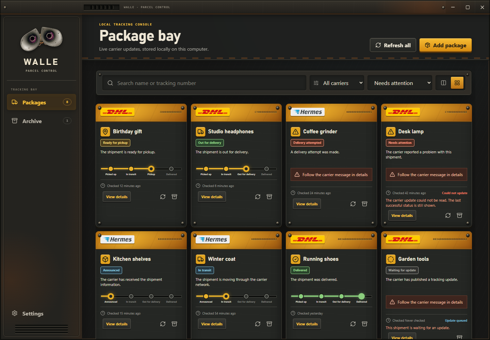
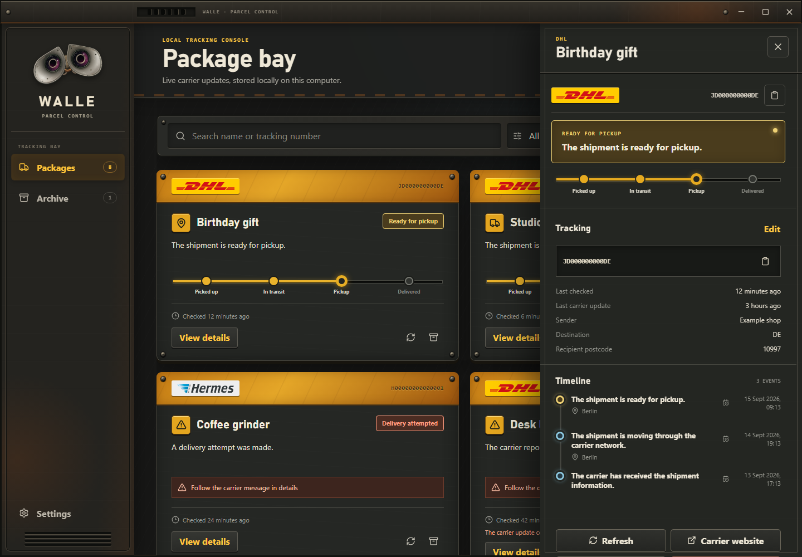
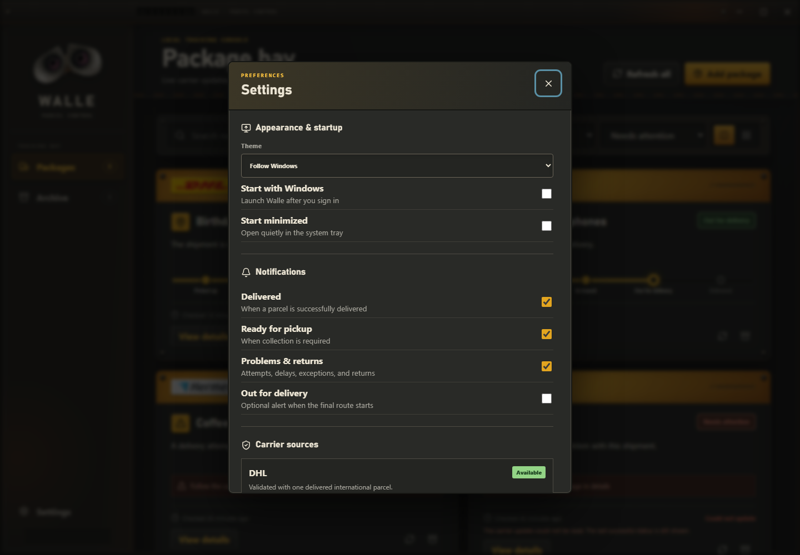

# Walle


> A local-first Windows parcel tracker for DHL Paket and Hermes.

## Screenshots

<table>
  <tr>
    <td align="center" width="33%"></td>
    <td align="center" width="33%"></td>
    <td align="center" width="33%"></td>
  </tr>
  <tr>
    <td align="center"><sub><b>Package bay</b><br>Multiple delivery states at a glance</sub></td>
    <td align="center"><sub><b>Package details</b><br>Progress and full event timeline</sub></td>
    <td align="center"><sub><b>Settings</b><br>Notifications and source health</sub></td>
  </tr>
</table>

Walle is a local-first personal Windows package tracker built with Tauri v2, React, TypeScript, Rust, and SQLite. It tracks DHL Paket Germany and Hermes Germany shipments from their public tracking flows, keeps the collection on this computer, refreshes active parcels in the background, and shows package cards with full event timelines.

No paid tracking API, Python service, browser driver, or Docker runtime is required by the installed app. Scraping depends on carrier-owned public endpoints and may need maintenance when those sites change.

## Features

- package names, tracking numbers, carrier detection, and optional destination details;
- active, delivered, and archived views with search, carrier filters, and sorting;
- manual and automatic refresh with conservative per-carrier throttling;
- cached offline results, failure states, system-tray operation, autostart, and Windows notifications;
- direct carrier and supported international partner links;
- light, dark, and Windows-following themes.

## Requirements

Install the current Rust toolchain, Node.js 24 or newer, Microsoft C++ Build Tools, and WebView2.

## Run locally

From the repository root:

```powershell
cd ui
npm install
npm run tauri dev
```

The SQLite database is created in Walle's Tauri application-data directory. The browser-only Vite preview uses synthetic local data and never contacts a carrier.

## Build the Windows installer

```powershell
cd ui
npm ci
npm run tauri build
```

Tauri writes the NSIS installer under `src-tauri/target/release/bundle/nsis`.

## Checks

```powershell
cargo fmt --all -- --check
cargo clippy --locked --all-targets -- -D warnings
cargo test --locked --all-targets

cargo fmt --manifest-path src-tauri/Cargo.toml --all -- --check
cargo clippy --manifest-path src-tauri/Cargo.toml --locked --all-targets -- -D warnings
cargo test --manifest-path src-tauri/Cargo.toml --locked --all-targets

cd ui
npm run typecheck
npm test
npm run build
```

## Docker checks

Docker covers the scraper core, frontend build, and Linux compilation of the Tauri backend. The final NSIS installer is produced on Windows because it uses the Windows WebView2 and packaging toolchain.

```powershell
docker compose run --rm core-check
docker compose run --rm ui-check
docker compose run --rm native-check
```

## Optional live probe

The probe asks for the number interactively so it does not have to appear in shell history. It redacts tracking identifiers from result and error output.

```powershell
cargo run --locked --bin tracking-probe -- dhl
cargo run --locked --bin tracking-probe -- hermes
```

The DHL adapter has been validated against a user-owned delivered international parcel. The Hermes adapter has been validated against user-owned announced and parcel-shop handoff states, including an international partner-carrier link. Later Hermes delivery states and DHL optional-input success responses are fixture-tested and should be rechecked when suitable user-owned parcels become available.

## Documentation

- [Design specification](DESIGN_SPEC.md)
- [Scraper implementation plan](docs/SCRAPER_IMPLEMENTATION_PLAN.md)
- [DHL source contract](docs/sources/dhl_paket_de.md)
- [Hermes source contract](docs/sources/hermes_de.md)
