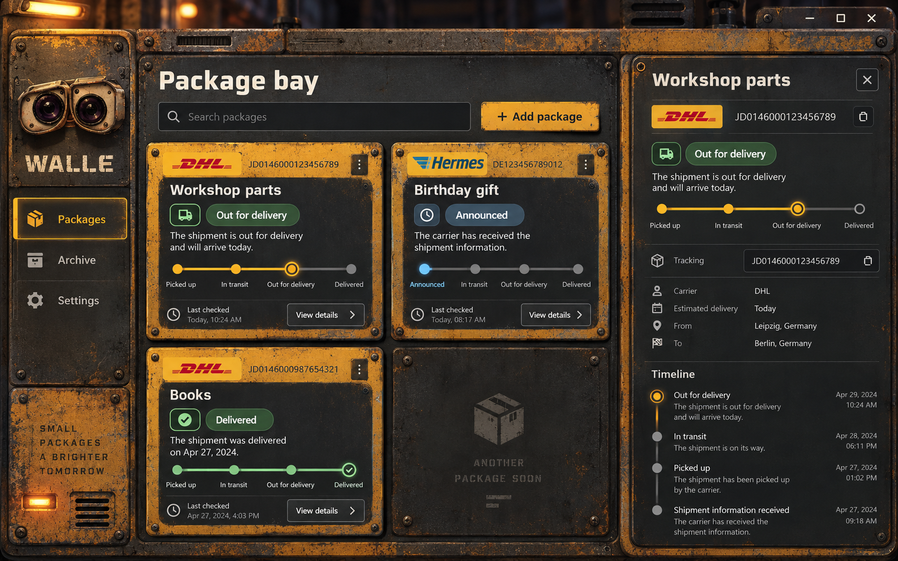

# Walle industrial UI direction

The generated concept is the visual reference for Walle's desktop interface. It translates the supplied utility-robot reference into an original application shell without using a movie character or studio marks.

## Design language

- A dark workshop chassis anchors the navigation and content.
- Worn ochre top plates identify each parcel as a machine module; the dark card body has no colored side rails.
- Recessed graphite displays keep package names and updates clean and readable.
- Rivets, vents, seams, authentic locally bundled carrier logos, indicator lamps, and physical progress rails provide the mechanical character.
- Muted blue signals neutral movement, green marks successful delivery, amber carries the primary action, and red identifies problems.
- All visible interface and carrier-status text is English.
- Do not use colored left or right borders as selection, status, alert, card, drawer, or section accents. Use surface color, horizontal seams, icons, lamps, and shadows instead.
- Keep the application window fixed with no document-level scrollbar. Give only overflowing content regions—the package bay, details drawer, and modal body—their own dark bronze custom scrollbar.
- Let the user switch the package bay between a comfortable two-column layout and a compact four-column layout. Persist the choice locally and reduce columns responsively when the window cannot fit four readable cards.
- Draw progress rails continuously across the milestones, with the completed color running from the rail's beginning through the current milestone.

## Image generation prompt

Use case: `ui-mockup`. Create a high-fidelity 1440×900 Tauri desktop package tracker informed by the attached reference image's worn utility-machine materials. Use a dark charcoal workshop console, safety-yellow chipped steel, rust, rivets, vents, recessed displays, mechanical gauges, blue and green indicator lamps, readable English parcel cards, and an open tracking drawer. Include package navigation, filters, DHL and Hermes cards, status progress rails, and package details. Keep the design practical to implement in React and CSS. Do not depict or copy the WALL-E character, Disney or Pixar marks, or any movie logo. Avoid German text, illegible labels, excessive ornament, holograms, and grunge over content.

## Implementation notes

The production UI recreates the concept with responsive React markup and CSS gradients rather than shipping the concept screenshot as an application background. This keeps text crisp, controls accessible, themes functional, and the interface usable from narrow windows through desktop layouts.
